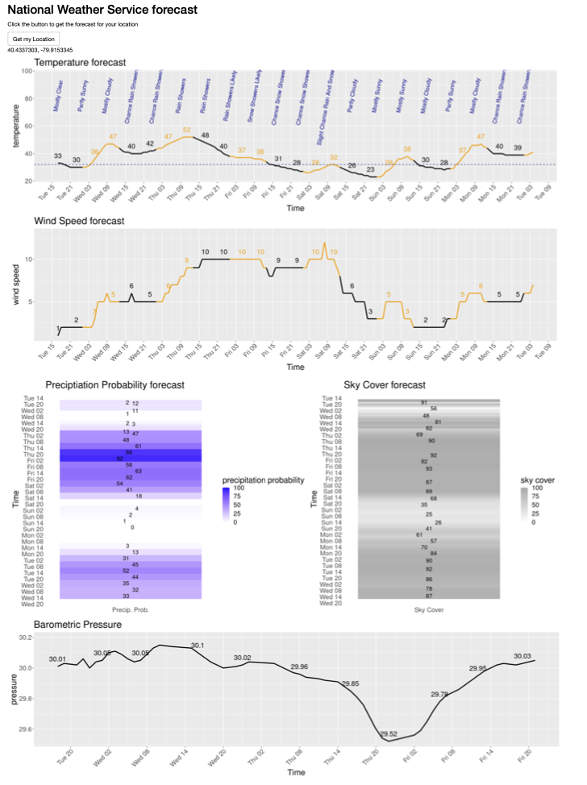

# NWS_WeatherShinyApp

## Purpose

The `NWS_ShinyApp.R` file encodes a Shiny app that graphs and presents the National Weather Service forecast, after first querying the device for its location.  The data are pulled from the National Weather Service API (https://weather-gov.github.io/api/general-faqs).  

The `NWS_API.Rmd` R markdown file contains code that was experimented with during development, a subset of which ended up in the Shiny app. 

## Example weather report

Here is an example weather report, generated from the initial version of the R Shiny app - this may not refect subsequent changes to the app. 

## Comments, suggestions, and bug reports

Please open a GitHub issue here:

https://github.com/DanielEWeeks/NWS_WeatherShinyApp/issues

## Acknowledgements

This code is built on the contributions of others:

The initial framework for the Shiny app is derived from this example that illustrates how to use the `geoloc` R package from https://github.com/ColinFay/geoloc to query the location of one's device:

 https://stackoverflow.com/questions/71850331/vectors-of-latitude-and-longitude-in-geolocation-app-in-shiny
 
And the code for pulling the weather forecast data via the National Weather Service API is based on Joe Guiness's code that he shared in his YouTube video where he shows how to access the National Weather Service API:

https://youtu.be/hxl1c8WRNiA

The `coord_y_datetime` function is from https://stackoverflow.com/questions/43625341/reverse-datetime-posixct-data-axis-in-ggplot

